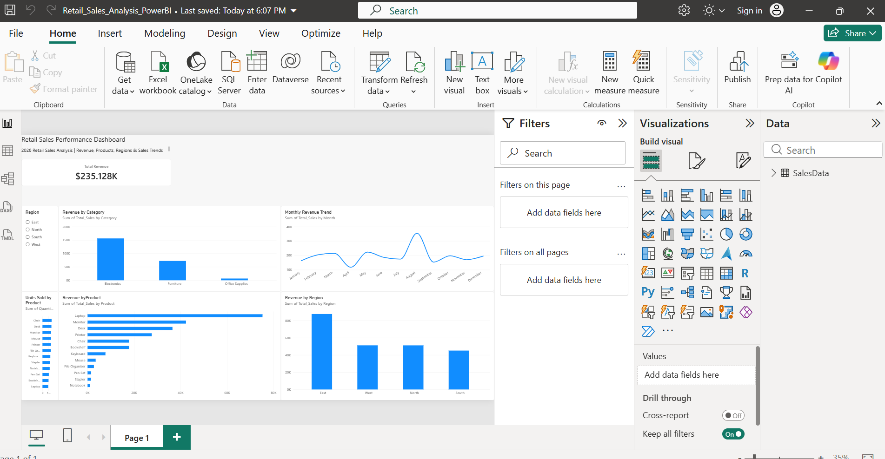

# Retail-Sales-Analysis

## Project Overview

This project analyzes 500 retail sales transactions using Excel, SQL, and Power BI. The goal was to identify key sales trends, evaluate product and regional performance, and develop KPIs that could help a business better understand its sales performance.

The project follows an end-to-end data analytics workflow, including data cleaning and analysis in Excel, SQL-based business analysis, and the development of an interactive Power BI dashboard.

## Tools Used

- **Microsoft Excel** — Data cleaning, PivotTables, and initial sales analysis
- **SQL** — Data analysis and business-focused queries
- **Power BI** — Interactive dashboard development, KPI tracking, and data visualization

## Business Questions

The analysis was designed to answer the following business questions:

1. What is the total revenue generated?
2. Which product category generates the most revenue?
3. Which product generates the most revenue?
4. Which product has the highest quantity sold?
5. Which region generates the most revenue?
6. Which month has the highest sales?
7. Which month has the lowest sales?
8. What KPIs can be used to monitor overall sales performance?

## KPI Analysis

The following KPIs were developed to evaluate overall retail sales performance:

| KPI | Result |
|---|---:|
| Total Revenue | $235,128 |
| Top Revenue Category | Electronics |
| Top Revenue Product | Laptop |
| Highest Units Sold | Chair |
| Top Revenue Region | East |
| Highest Sales Month | August |
| Lowest Sales Month | April |

## Excel Analysis

Excel was used to organize and analyze the retail sales data before moving into SQL and Power BI.

The analysis included:

- Reviewing and organizing the dataset
- Creating PivotTables to analyze sales performance
- Analyzing revenue by category, product, and region
- Analyzing product quantity sold
- Analyzing monthly sales trends
- Creating charts to visualize the results
- Summarizing key findings for business analysis

## SQL Analysis

SQL was used to analyze the dataset and answer key business questions.

The analysis included:

- Calculating total revenue
- Comparing revenue by product category
- Identifying the highest-revenue products
- Comparing product sales quantities
- Comparing revenue across regions
- Analyzing monthly revenue
- Sorting results to identify top and lowest performers

### Example SQL query:

```sql
SELECT Product,
       SUM(Total_Sales) AS Total_Revenue
FROM Retail_Sales_Analysis_Dataset
GROUP BY Product
ORDER BY Total_Revenue DESC;
```

## Power BI Dashboard

Power BI was used to create an interactive dashboard for monitoring retail sales performance.

The dashboard includes:

- Total Revenue KPI
- Revenue by Category
- Revenue by Product
- Revenue by Region
- Monthly Revenue Trend
- Units Sold by Product
- Interactive Region Filter

The dashboard allows users to filter sales performance by region and quickly identify changes in revenue, product performance, and sales trends.
### Dashboard Preview



## Key Findings

The analysis identified several important sales trends:

- **Electronics** generated the highest revenue among the product categories.
- **Laptops** generated the highest revenue among individual products.
- **Chairs** had the highest quantity sold, demonstrating that the product with the highest sales volume was not necessarily the highest-revenue product.
- The **East region** generated the highest regional revenue.
- **August** had the highest monthly sales.
- **April** had the lowest monthly sales.
- Total revenue across the 500 transactions was **$235,128**.

## Business Recommendations

Based on the analysis, the following areas could be investigated:

- Continue monitoring the **Electronics** category because it generated the highest revenue.
- Investigate why **Laptops** generated the most revenue while **Chairs** had the highest quantity sold. This can help determine how sales volume and revenue differ across products.
- Investigate factors that may have contributed to **August** having the highest sales and **April** having the lowest sales.
- Investigate what factors may be contributing to the **East region's** stronger sales performance.

## Skills Demonstrated

This project demonstrates the following data analytics skills:

- Data cleaning and organization
- Excel PivotTables and data analysis
- SQL querying and aggregation
- KPI development
- Power BI dashboard development
- Data visualization
- Business-focused analysis
- Identifying trends and patterns
- Communicating data-driven insights

## Project Summary

This project demonstrates an end-to-end data analytics workflow, from organizing and analyzing raw retail data to developing KPIs and an interactive Power BI dashboard. The analysis was used to identify important sales trends, product performance, and regional performance and translate those findings into potential business recommendations.
